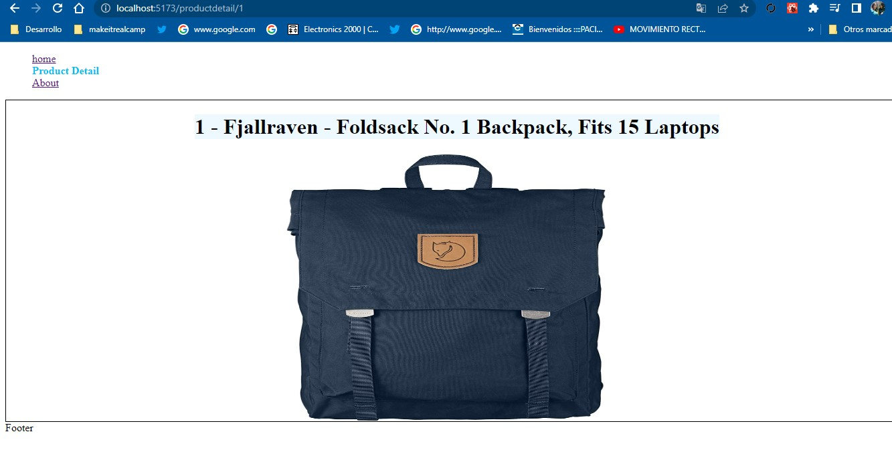
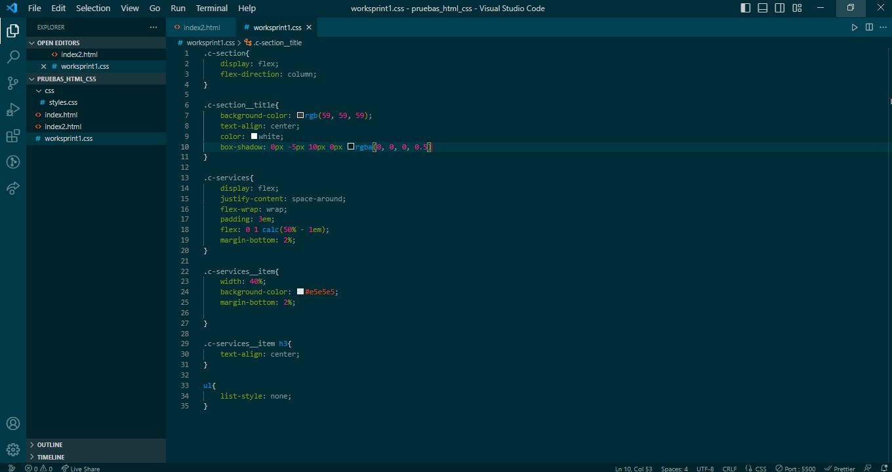
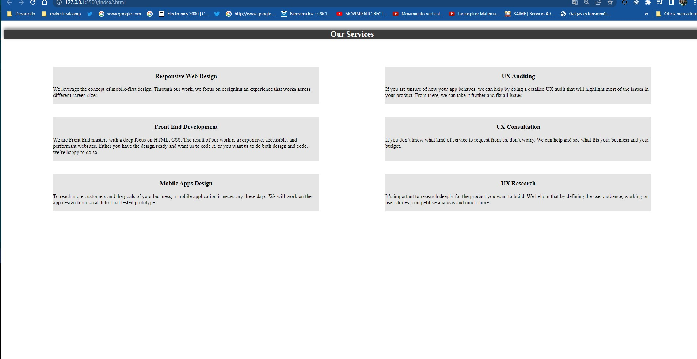

# Make It Real -Workshop Sprint 1


solution to Workshop Sprint 1

## Table of contents

## Table of contents

- [Overview](#overview)
  - [The challenge](#the-challenge)
  - [Screenshot](#screenshot)
- [My process](#my-process)
  - [Built with](#built-with)
  - [What I learned](#what-i-learned)
  - [Continued development](#continued-development)
  - [Useful resources](#useful-resources)
- [Author](#author)
- [Acknowledgments](#acknowledgments)


## Overview :
-la aplicaci+on fue construida para poder ingresar a varias paginas con react-router-dom, donde listamos  unos productos y al dar click nos lleva a la pagina de article , donde nos muestra un mayor detalle del producto,

### The challenge

-fue un buen desafio, donde se practico react con la libreria react-router-dom  para ingresar a varias paginas desde un menu de navegación cada vez que se da click nos lleva a una pagina sin que se cargue el navegador.


### Screenshot
-se adjunta imagenes del proyecto y de las preguntas: 2. Preguntas Dado el siguiente codePen, el cual solo tiene un HTML, por medio de css llegar a esta respuesta. Imagen. (Para mostrar los servicios debes usar CSS Flexbox o CSS Grid).







## My process


### Built with

-Reac-router-dom
-react-countdown
-react
-css

### What I learned


en este proyecto aprendimos como crear un router para poder navegar entre varias paginas con react-router-dom y tambien creamos una cuenta regresiva para que en el listado de los productos salga un boton mientras este activo el tiempo, despues del tiempo se desaparece el boton.
ejemplo del codigo:

No dejamos como randon el tiempo que sale si no pares e impares como se deja en el ejemplo: 

```js
import React, { useRef } from "react";
import PropTypes from 'prop-types';
import Countdown from 'react-countdown'
import { Link, useNavigate} from 'react-router-dom'
import './Temporizador.css'

export const Temporizador = (props) => {
    const {product} =props
    const {id}=product
    const numId=parseInt(id)
    let Ntempo=0;
    
    if(numId%2 ==0){
        Ntempo=59000*3;
    }else{
        Ntempo=59000;
    }
       
const Completionist = () => <span>Time is up! purchase for this product</span>;  
const navegar=useNavigate();

const handleClick=(event)=>{
    navegar(`/productdetail/${id}`)
    
 }
 const renderer = ({ hours, minutes, seconds, completed }) => {
        if (completed) {
          // Render a completed state
          return <Completionist />;
        } else {
          // Render a countdown
          return <div className="Temporizadorcard">
            <div className="Temporizadorcard--span">
            <span>{hours}:{minutes}:{seconds}</span>
            </div>
            <div className="Temporizadorcard--btn">
            <button className='Productcard_action--btn' onClick={handleClick}>Go TO Detail</button>
            </div>
            </div>
        }
      };
  
    
return (
  <div>
    <Countdown
      date={Date.now() + Ntempo}
      renderer={renderer}
    />
   
  </div>
);
   
 
}
export default Temporizador

```

### Continued development
- I will continue practicing to have a better handling of DOM, studying and consulting my mentors so that every day I improve my knowledge.

 ### Useful resources
- https://classroom.makeitreal.camp/courses/82/topics/353/progress -- This helped me I will use it in the future.
-https://www.npmjs.com/package/react-countdown
-https://www.npmjs.com/package/react-router-dom

## Author

- email - [guialexander@gmail.com]
- Github - [guialexander]
- Twitter - [@guialexander1](https://www.twitter.com/guialexander1)

## Acknowledgments

-I want to thank the make it real family since it has given me a new vision of my working life to improve and get out of the comfort zone and know that we can give more than what we already know
